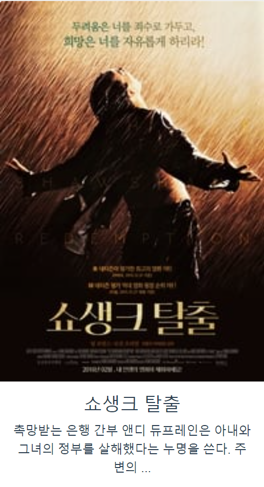
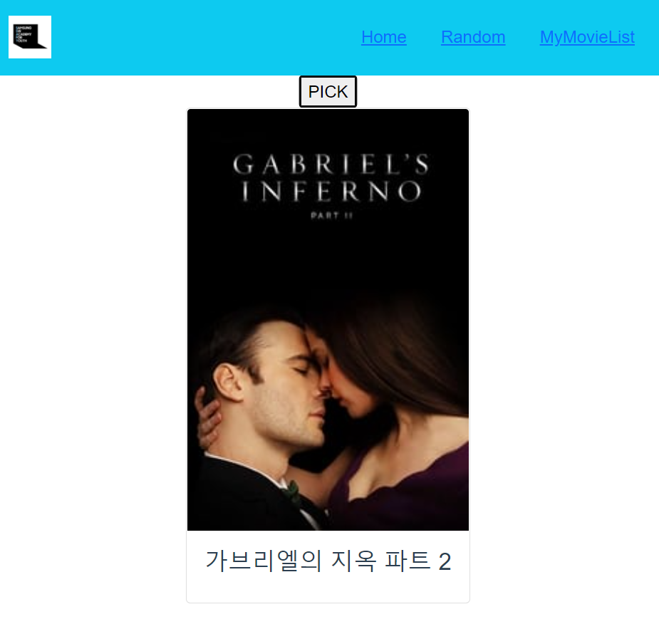
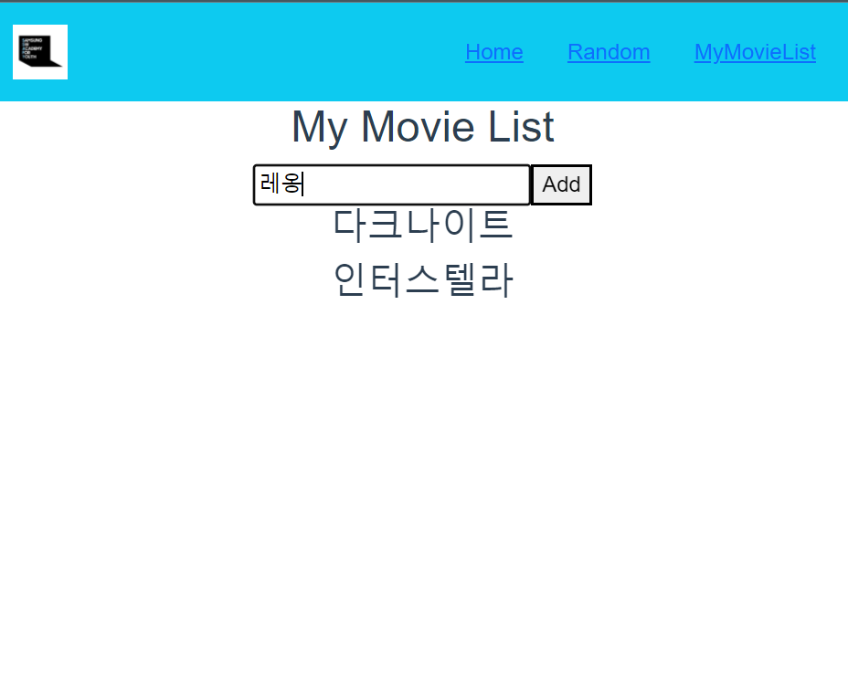

# 📌 My Tenth Project 📋

---

##### - Outline : 2022년 5월 13일, 열번째 관통 프로젝트를 수행하였다. 교육을 받으면서 마지막 관통 프로젝트임을 알기에 후련하였다. 사실, 첫번째 관통 프로젝트를 수행할 때부터 굉장히 많은 응용력을 요구하였기 때문에 부담스러웠던 것이 크다. 다른 사람들도 다 하길래, 발자국 따라 앞으로 나아갔던 것 같다. 그렇게 수행하다보니 마지막 관통 프로젝트라는 것이 좀 아쉽기도 한 것이 사실이다. 앞으로는 스스로 프로젝트에 대한 구상을 하며 새로운 것을 만들어 나아가보려 한다. 이런 마음을 가질 수 있게 해준 지금까지의 모든 관통 프로젝트는 나에게 있어 소중한 존재로 간직하려 한다.

##### 또한 오늘 프로젝트는 '전상현' 학우와 페어를 이루어 수행하였다. 이전에도 몇 번 같이 프로젝트를 수행하였던 경험이 있는데, 정말 나에게 있어 많은 힘이 되어 주는 사람이다. 다음 최종 프로젝트에도 같이 고생할 사이인데 많이 든든한 사람이어서 안심이 된다. 오늘처럼 같이 힘을 모아 나아간다면 그것 또한 좋은 경험이 될 것이라 생각한다.

##### 오늘 프로젝트의 결과를 캡쳐하여 게시하려 한다.

---

 

# **< Title : Vue를 활용한 SPA 구성 >**

*(This project was carried out in **Node 16 and Vue.js 2 environment .**)*

- *요구사항 : 영화 정보를 제공하는 SPA를 제작한다.*

---

*(코드는 제외하고, 프로젝트의 각 요구사항에 맞는 결과에 대해 게시합니다.)*

 

- **HomeView.vue**

  > */URL과 매핑되는 컴포넌트입니다.*
  >
  > *AJAX 통신을 이용하여 다수의 영화 데이터를 수집합니다.*
  >
  > *수집한 영화 데이터를 1개씩 MovieCard.vue를 활용하여 출력합니다.*

  

 

- **MovieCard.vue**

  > *HomeView.vue의 구성 컴포넌트입니다.*
  >
  > *개별 영화 데이터의 포스터, 제목, 줄거리를 적절한 layout으로 출력합니다.*

  

 

- **RandomView.vue**

  > */random URL과 매핑되는 컴포넌트입니다.*
  >
  > *AJAX 통신을 이용하여 다수의 영화 데이터를 수집합니다.*
  >
  > *Pick 버튼을 클릭하면 무작위로 영화 데이터를 선택하여 출력합니다.*

  

 

- **WatchListView.vue**

  > */watch-list URL과 매핑되는 컴포넌트입니다.*
  >
  > *보고싶은 영화 제목을 저장합니다.*
  >
  > *WatchListForm.vue와 WatchListItem.vue로 구성되어 있습니다.*

  

---

 

최종 프로젝트를 앞두고 어떤 툴을 사용해야 할 지, 그에 대한 선택과 집중은 나에게 주어진 숙제인 것 같다. 배운 것을 모두 응용함과 동시에 다른 툴들의 추가 사용으로 그 결과에 대한 차이를 도출해 내는 것. 그것이 내가 바라는 것이기 때문이다.

다음에 올려질 나의 최종 프로젝트는 초라하지 않을 수 있도록 지금까지 배운 것들을 모두 응용하며 새롭게 배워보고 적용시켜 보려고 한다. 내가 그리는 그림이 있다. 완성시킬 것이다.

